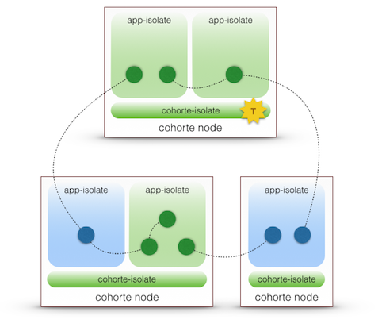
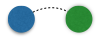

[Home](../../../) > [Documentation](../)

## Key Concepts of Cohorte 

A COHORTE system is a set of (distributed) Software Components connected together to ensure some functionality. 

The following picture illistrates the overall view of COHORTE system. Each elements is detailed hereafter.

 

#### Nodes

 Represents a physical device or a virtual machine where a set of Isolates executes.

#### Isolates

An Isolate is a system process executing and managing a set of Components.

 Cohorte and Application Isolates

 Top Cohorte Isolate

#### Components

 Cohorte Components represents a software component providing a service and eventually requiring other services to do ensure some tasks. Components can be implemented using Python or Java programming languages. We support and provide component-based framework for each language.
Cohorte components implements only business logic, all the distribution and dependencies with other components are managed by COHORTE. 

Component Factory is an object that allows the instantiation of components (instances) of the same type.

#### Application

A Composite is a logical representation of a hierarchical node in a composition graph. It contains a set of components and other composites and it can define configuration properties that will override the ones used in their children components and composites.

An Application is a logical abstract description of the set of components/composites and the possible wires between them.

#### Composers

The Composer is a special COHORTE Runtime Component responsible of instantiating the different components of an application. In COHORTE there are different Composer levels:

 * *Top Composer*: It loads the composition declarative description and computes the sets of components according to the node they must be instantiated on.
 * *Node Composer*: It calculates the different isolates that must be exist for the local set of components.
 * *Isolate Composer*: It uses framework-specific agents to request the instantiation of the components assigned to its isolate, and looks after their evolution.

