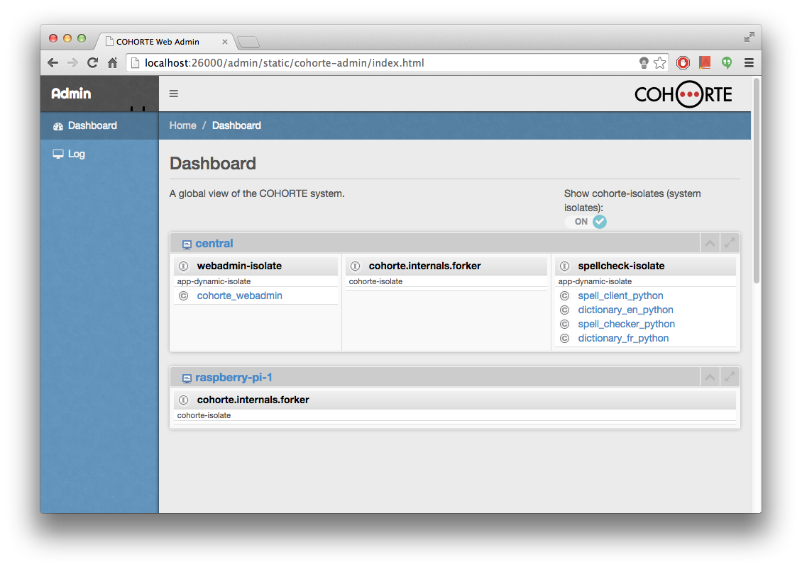

[Home](../../../) > [Documentation](../)

## Admin REST API v1

### Introduction

In this document, we detail the ADMIN RESTful API v1 of COHORTE platform.

## Web Admin

It uses Admin REST API v1.

### API endpoints

<table class="table table-striped table-bordered table-hover table-condensed">
<thead><tr><th>Code</th><th>Action</th></tr></thead>
<tbody><tr><td>APIV1-001</td><td>
<a href="#APIV1-001">Get the list of all Nodes</a>
</td></tr>
<tr><td>APIV1-002</td><td>
<a href="#APIV1-002">Get the list of all Isolates</a>
</td></tr>
<tr><td>APIV1-003</td><td>
<a href="#APIV1-003">Get the list of all Components</a>
</td></tr>
<tr><td>APIV1-050</td><td>
<a href="#APIV1-050">Get Node details</a>
</td></tr>
<tr><td>APIV1-051</td><td>
<a href="#APIV1-051">Get Isolate details</a>
</td></tr>
<tr><td>APIV1-053</td><td>
<a href="#APIV1-053">Get Component details</a>
</td></tr>
<tr><td>APIV1-100</td><td>
<a href="#APIV1-100">Get the list of Isolates in one particular Node</a>
</td></tr>
<tr><td>APIV1-101</td><td>
<a href="#APIV1-101">Get the list of Components in one particular Isolate</a>
</td></tr></tbody>
</table>

### Detail of REST APIs

<a name="APIV1-001"/>

#### APIV1-001 : GET the list of all Nodes

 * URL: `http://myhost:port/admin/api/v1/nodes`
 * Supported request methods: `GET`
 * Response format: `json`
 * Requires authentication?: `not required`
 * Response:

<table class="table table-striped table-bordered table-hover table-condensed">
<thead><tr><th>Field</th><th>Type</th><th>Description</th></tr></thead>
<tbody>
<tr><td>meta</td><td>Map</td><td>meta-information about the response</td></tr>
<tr><td>+ code</td><td>Integer</td><td>Return code</td></tr>
<tr><td>+ count</td><td>Integer</td><td>Number of results</td></tr>
<tr><td>nodes</td><td>Array</td><td>Array of information about the nodes</td></tr>
<tr><td>+ uid</td><td>String</td><td>Node UID</td></tr>
<tr><td>+ name</td><td>String</td><td>Node Name</td></tr>
</tbody>
</table>

 * JSON Response Example : 


{
    "meta": {
        "code": 200,
        "count": 2
    },
    "nodes": [
        {
            "uid": "56e5b100-c8a2-4bd8-a818-30edaf9a8fe9",
            "name": "central"
        },
        {
            "uid": "acfd6479-f29f-4bf0-ae4d-acd681e3a531",
            "name": "raspberry-pi-1"
        }
    ]
}


 

<a name="APIV1-002"/>

#### APIV1-002 : GET the list of all Isolates

 * URL: `http://myhost:port/admin/api/v1/isolates`
 * Supported request methods: `GET`
 * Response format: `json`
 * Requires authentication?: `not required`
 * Response:

<table class="table table-striped table-bordered table-hover table-condensed">
<thead><tr><th>Field</th><th>Type</th><th>Description</th></tr></thead>
<tbody>
<tr><td>meta</td><td>Map</td><td>meta-information about the response</td></tr>
<tr><td>+ code</td><td>Integer</td><td>Return code</td></tr>
<tr><td>+ lastupdate</td><td>Float</td><td>Last update time of the actual isolates list</td></tr>
<tr><td>+ count</td><td>Integer</td><td>Number of results</td></tr>
<tr><td>isolates</td><td>Array</td><td>Array of information about the isolates</td></tr>
<tr><td>+ uid</td><td>String</td><td>Isolate UID</td></tr>
<tr><td>+ name</td><td>String</td><td>Isolate Name</td></tr>
<tr><td>+ node_uid</td><td>String</td><td>Node UID</td></tr>
<tr><td>+ node_name</td><td>String</td><td>Node Name</td></tr>
</tbody>
</table>

 * JSON Response Example : 


{
    "meta": {
        "code": 200,
        "lastupdate": 1411979225.65,
        "count": 2
    },
    "isolates": [
        {
            "uid": "50684926acb4387d0f007ced",
            "name": "webadmin-isolate",
            "node_uid": "41110b1d-b510-4e51-9945-a752da04a16d",
            "node_name": "central"
        },
        {
            "uid": "03ff839a-df24-4bdf-b734-9fac1c886c65",
            "name": "spellcheck-isolate",
            "node_uid": "41110b1d-b510-4e51-9945-a752da04a16d",
            "node_name": "central"
        }
    ]
}


 

<a name="APIV1-003"/>

#### APIV1-003 : GET the list of all Components

 * URL: `http://myhost:port/admin/api/v1/components`
 * Supported request methods: `GET`
 * Response format: `json`
 * Requires authentication?: `not required`
 * Response:

<table class="table table-striped table-bordered table-hover table-condensed">
<thead><tr><th>Field</th><th>Type</th><th>Description</th></tr></thead>
<tbody>
<tr><td>meta</td><td>Map</td><td>meta-information about the response</td></tr>
<tr><td>+ code</td><td>Integer</td><td>Return code</td></tr>
<tr><td>+ count</td><td>Integer</td><td>Number of results</td></tr>
<tr><td>components</td><td>Array</td><td>Array of information about the components</td></tr>
<tr><td>+ name</td><td>String</td><td>Component name</td></tr>
<tr><td>+ factory</td><td>String</td><td>Component Factory</td></tr>
<tr><td>+ language</td><td>String</td><td>Programming language</td></tr>
<tr><td>+ isolate_uid</td><td>String</td><td>Isolate UID</td></tr>
<tr><td>+ isolate_name</td><td>String</td><td>Isolate Name</td></tr>
</tbody>
</table>

 * JSON Response Example : 


{
    "meta": {
        "code": 200,
        "count": 2
    },
    "components": [
        {
            "name": "spell_check_client",
            "factory": "spell_check_client_factory",
            "language": "python",
            "isolate_uid": "03ff839a-df24-4bdf-b734-9fac1c886c65",
            "isolate_name": "spellcheck-isolate"
        },
        {
            "name": "spell_dictionray_FR",
            "factory": "spell_dictionary_FR_factory",
            "language": "python",
            "isolate_uid": "03ff839a-df24-4bdf-b734-9fac1c886c65",
            "isolate_name": "spellcheck-isolate"
        }
    ]
}


 

<a name="APIV1-050"/>

#### APIV1-050 : GET Node detail

 * URL: `http://myhost:port/admin/api/v1/nodes/56e5b100-c8a2-4bd8-a818-30edaf9a8fe9`
 * Supported request methods: `GET`
 * Response format: `json`
 * Requires authentication?: `not required`
 * Response:

<table class="table table-striped table-bordered table-hover table-condensed">
<thead><tr><th>Field</th><th>Type</th><th>Description</th></tr></thead>
<tbody>
<tr><td>meta</td><td>Map</td><td>meta-information about the response</td></tr>
<tr><td>+ code</td><td>Integer</td><td>Return code</td></tr>
<tr><td>+ node</td><td>String</td><td>Node UID</td></tr>
<tr><td>node</td><td>Map</td><td>General informations about the wanted Node</td></tr>
<tr><td>+ name</td><td>String</td><td>Node name</td></tr>
<tr><td>+ nbr_isolates</td><td>Integer</td><td>Number of Isolates</td></tr>
</tbody>
</table>

 * JSON Response Example : 


{
    "meta": {
        "node": "41110b1d-b510-4e51-9945-a752da04a16d",
        "code": 200
    },
    "node": {
        "name": "central",
        "nbr_isolates": 3
    }
}


 

<a name="APIV1-051"/>

#### APIV1-051 : GET Isolate detail

 * URL: `http://myhost:port/admin/api/v1/isolates/50684926acb4387d0f007ced`
 * Supported request methods: `GET`
 * Response format: `json`
 * Requires authentication?: `not required`
 * Response:

<table class="table table-striped table-bordered table-hover table-condensed">
<thead><tr><th>Field</th><th>Type</th><th>Description</th></tr></thead>
<tbody>
<tr><td>meta</td><td>Map</td><td>meta-information about the response</td></tr>
<tr><td>+ code</td><td>Integer</td><td>Return code</td></tr>
<tr><td>+ isolate</td><td>String</td><td>Isolate UID</td></tr>
<tr><td>isolate</td><td>Map</td><td>General informations about the wanted Node</td></tr>
<tr><td>+ name</td><td>String</td><td>Isolate name</td></tr>
<tr><td>+ type</td><td>String</td><td>Type of this isolate: <ul><li>cohorte-isolate</li><li>app-dynamic-isolate</li></ul></td></tr>
<tr><td>+ nbr_components</td><td>Integer</td><td>Number of components in this isolate</td></tr>
<tr><td>+ node_uid</td><td>String</td><td>Isolate's Node UID</td></tr>
<tr><td>+ node_name</td><td>String</td><td>Isolate's Node name</td></tr>
</tbody>
</table>

 * JSON Response Example : 


{
    "meta": {
        "isolate": "50684926acb4387d0f007ced",
        "code": 200
    },
    "isolate": {
        "name": "webadmin-isolate",
        "type": "cohorte-isolate",
        "nbr_components": 3,
        "node_uid": "41110b1d-b510-4e51-9945-a752da04a16d",
        "node_name": "central"
    }
}


 

<a name="APIV1-052"/>

#### APIV1-052 : GET Component detail

 * URL: `http://myhost:port/admin/api/v1/components/spell_check_client`
 * Supported request methods: `GET`
 * Response format: `json`
 * Requires authentication?: `not required`
 * Response:

<table class="table table-striped table-bordered table-hover table-condensed">
<thead><tr><th>Field</th><th>Type</th><th>Description</th></tr></thead>
<tbody>
<tr><td>meta</td><td>Map</td><td>meta-information about the response</td></tr>
<tr><td>+ code</td><td>Integer</td><td>Return code</td></tr>
<tr><td>+ component</td><td>String</td><td>Component name</td></tr>
<tr><td>component</td><td>Map</td><td>General informations about the wanted Component</td></tr>
<tr><td>+ factory</td><td>String</td><td>Component Factory name</td></tr>
<tr><td>+ language</td><td>String</td><td>Programming language</td></tr>
<tr><td>+ isolate_uid</td><td>String</td><td>Isolate UID</td></tr>
<tr><td>+ isolate_name</td><td>String</td><td>Isolate name</td></tr>
<tr><td>+ bundle_name</td><td>String</td><td>Bundle name</td></tr>
<tr><td>+ bundle_version</td><td>String</td><td>Bundle version</td></tr>
<tr><td>+ properties</td><td>Map</td><td>Component properties</td></tr>
</tbody>
</table>

 * JSON Response Example : 


{
    "meta": {
        "component": "spell_check_client",
        "code": 200
    },
    "node": {
        "name": "spell_check_client",
        "factory": "spell_check_client_factory",
        "language": "python",
        "isolate_uid": "03ff839a-df24-4bdf-b734-9fac1c886c65",
        "isolate_name": "spellcheck-isolate"
        "bundle_name": "spellchecker.spell_check"
        "bundle_version": "1.0.0"
        "properties": {
             "prop1": "value1",
             "prop2": "value2",
        }
    }
}


 

<a name="APIV1-100"/>

#### APIV1-100 : Get Isolates of one particular Node

 * URL: `http://myhost:port/admin/api/v1/nodes/56e5b100-c8a2-4bd8-a818-30edaf9a8fe9/isolates`
 * Supported request methods: `GET`
 * Response format: `json`
 * Requires authentication?: `not required`
 * Response:

<table class="table table-striped table-bordered table-hover table-condensed">
<thead><tr><th>Field</th><th>Type</th><th>Description</th></tr></thead>
<tbody>
<tr><td>meta</td><td>Map</td><td>meta-information about the response</td></tr>
<tr><td>+ code</td><td>Integer</td><td>Return code</td></tr>
<tr><td>+ node</td><td>String</td><td>Node name</td></tr>
<tr><td>+ count</td><td>Integer</td><td>Number of results</td></tr>
<tr><td>isolates</td><td>Array</td><td>Array of isolates of the wanted Node</td></tr>
<tr><td>+ uid</td><td>String</td><td>Isolate UID</td></tr>
<tr><td>+ name</td><td>String</td><td>Isolate name</td></tr>
</tbody>
</table>

 * JSON Response Example : 


{
    "meta": {
        "node": "41110b1d-b510-4e51-9945-a752da04a16d",
        "code": 200,
        "count": 2
    },
    "isolates": [
        {
            "uid": "50684926acb4387d0f007ced",
            "name": "webadmin-isolate"
        },
        {
            "uid": "03ff839a-df24-4bdf-b734-9fac1c886c65",
            "name": "spellcheck-isolate"
        }
    ]
}


 

<a name="APIV1-101"/>

#### APIV1-101 : Get Components of one particular Isolate

 * URL: `http://myhost:port/admin/api/v1/isolates/50684926acb4387d0f007ced/components`
 * Supported request methods: `GET`
 * Response format: `json`
 * Requires authentication?: `not required`
 * Response:

<table class="table table-striped table-bordered table-hover table-condensed">
<thead><tr><th>Field</th><th>Type</th><th>Description</th></tr></thead>
<tbody>
<tr><td>meta</td><td>Map</td><td>meta-information about the response</td></tr>
<tr><td>+ code</td><td>Integer</td><td>Return code</td></tr>
<tr><td>+ isolate</td><td>String</td><td>Isolate UID</td></tr>
<tr><td>+ count</td><td>Integer</td><td>Number of results</td></tr>
<tr><td>components</td><td>Array</td><td>Array of components of the wanted Isolate</td></tr>
<tr><td>+ name</td><td>String</td><td>Component name</td></tr>
<tr><td>+ factory</td><td>String</td><td>Component Factory name</td></tr>
<tr><td>+ language</td><td>String</td><td>Component implementation language</td></tr>
</tbody>
</table>

 * JSON Response Example : 


{
    "meta": {
        "isolate": "50684926acb4387d0f007ced",
        "code": 200,
        "count": 3
    },
    "components": [
        {
            "name": "spell_dictionary_FR",
            "factory": "spell_dictionary_FR_factory",
            "language": "python"
        },
        {
            "name": "spell_check",
            "factory": "spell_check_factory",
            "language": "python"
        },
        {
            "name": "spell_client",
            "factory": "spell_client_factory",
            "language": "python"
        }
    ]
}


[Home](../../../) > [Documentation](../)