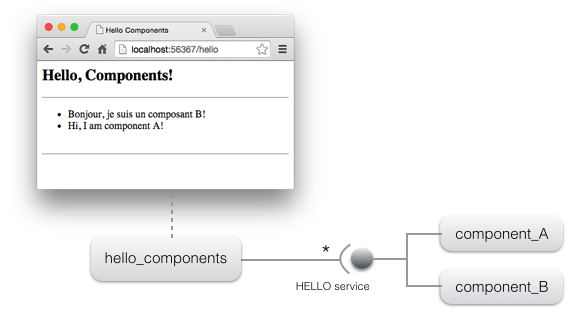
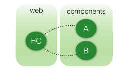
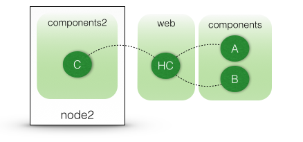
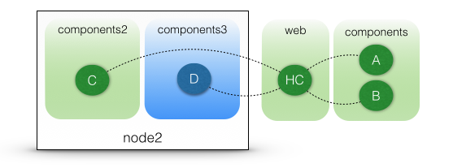

[Home](../../../../) > [Documentation](../../) > [Tutorials](../)

## Getting started tutorial

### Overview

 As a COHORTE user, you need to have Java ( >= 1.6 ) and Python ( >= 3 ) installed on your system. Next, you need to [download and install COHORTE on your system]({{ site.baseurl }}/docs/1.x/setup).
 
 The objective of this getting started tutorial is to get you familiar with the COHORTE concept as quickly as possible. There is no need to start coding at this step. You found other advanced tutorial in the [tutorials section of the documentation page]({{ site.baseurl }}/docs/1.x/tutorials).
 This getting started tutorial is divised in four steps:

 * **[STEP 1](#step1)**: creating a simple application on one node, but two seperate isolates. 
 * **[STEP 2](#step2)**: using two distributed nodes to host the same application (without changing the components implementation code).
 * **[STEP 3](#step3)**: using a mixture of Java and Python components.
 * **[STEP 4](#step4)**: crash-test

### STEP 1

 * Open a new terminal and type the following command on your working directory:

 <pre>
$ <b>cohorte-create-node</b> node1
</pre>

This command will create a new directory named `node1` containing an executable `run` (which launches the created COHORTE node) and two folders `conf` (contains configuration files) and `repo` (contains components bundles).

 * Download the bundle of this tutorial's components (no need to implement them in this getting started tutorial). 

 

 * Put the extracted `hello` directory into `node1/repo` directory.  
   * The `hello` package contains four components (implemented in Python):   
     * **component_A**, **component_B**, and **component_C**: these components implements the HELLO service which has only one method `say_hello`. 
     * **hello_components**: this component provides a web interface on which the list of discovered components implementing the HELLO service are listed (we show the message returned by each component when calling their `say_hello` method).

The following picture depicts the web interface provided by the **hello_components** component and the underlying architecture of the application.

 * In this first step of the tutorial, we want to instantiate only the components **HC** (hello_components), **A** (component_A) and **B** (component_B). In addition, we want to seperate between HC component and the other components providing the HELLO service (which can contain third-party code). COHORTE supports this separation by using **Isolates**. Isolates are a seperate process with all the needed runtime infrastructure allowing the execution of the managed components.
   The following picture depicts the desired resilient architecture. If one of the components providing the HELLO service fails, there will be no impact on the HC component! 

 * In order to have this deployment plan, you should edit the `node1/conf/autorun_conf.js` to specify the set of components that will be instantiated on each isolate.


{
	"name" : "default-application",
	"root" : {
		"name" : "default-application-composition",
		"components" : [ 
			{
				"name" : "HC",
				"factory" : "hello_components_factory",
				"isolate" : "web"
			}, {
				"name" : "A",
				"factory" : "component_a_factory",
				"isolate" : "components"
			}, {
				"name" : "B",
				"factory" : "component_b_factory",
				"isolate" : "components"
			}
		]
	}
}


 * **It's done!** all what's you need to do now is to start `node1` node as follow:

 <pre>
$ ./<b>run</b> -t
</pre>

You will notice some log outputs, when all is Ok, type the `load` command to start the application's composition:

 <pre>
$ <b>load</b>

Started composition: default-application -> b764f5eb-812c-4a2a-83f8-b3effa1e86ce

</pre>

 * To test your application, you need to know on which http port the `web` isolate is listening (as the HC component publish its web page using the same HTTP server as its isolate container). Type the `http` command to have this information.

<pre>
$ <b>http</b>

+------------+--------------------------------------+-----------+--------------------------------------+-------+
|    Name    |                 UID                  | Node Name |               Node UID               | HTTP  |
+============+======================================+===========+======================================+=======+
| components | 9fa3c812-64b0-499e-8b65-6ac5fe8bcf02 | node1     | 71c96fe6-5ce2-43c9-bafc-6f0905d8cf74 | 63625 |
+------------+--------------------------------------+-----------+--------------------------------------+-------+
| web        | ac0dd576-a7fb-4c34-b7ab-b68a810c38bc | node1     | 71c96fe6-5ce2-43c9-bafc-6f0905d8cf74 | 63609 |
+------------+--------------------------------------+-----------+--------------------------------------+-------+

</pre>

In this case, its `63609`. Launch a web browser with this address to start the web interface: `http://localhost:63609/hello`.

Note

You can fix the http port to use for your application using configuration files (see <a href="{{ site.baseurl }}/docs/1.x/startup">startup section of the documentation page</a>).

 * To stop COHORTE, type the `quit` command on the terminal.

### <a name="step2">Step 2

In this second step, we will distribute our components among two nodes (which can be physically distributed on a local network area - or via Internet using an XMPP server).

 * Lets have the same architecture as the first step, and we add a new instance of component_C that should be deployed on a second node. 

 Here is the new depoyment configuration for this case. 

COHORTE will instantiate the HC, A, and B components on Top Composer node. The component C is instantiate on each other node having the name "node2". This node can be located on another machine than the one executing the Top Composer.

In order to discover the nodes belonging to the same application, all the nodes should have the same *application-ID*. The following commands creates two nodes (node1 and node2) with the same *application-ID* `hello-application-step2`:

 <pre>
$ <b>cohorte-create-node</b> node1 hello-application-step2
$ <b>cohorte-create-node</b> node2 hello-application-step2
</pre>

 * Copy `hello` package used in the first step into the `repo directories of the two newly created nodes (you can also make symbolic links to avoid having two copies if your nodes are on the same machine).
 * Update `autorun_conf.js` file located on `node1/conf` as follow:


{
	"name" : "hello-application-step2",
	"root" : {
		"name" : "hello-application-step2-composition",
		"components" : [ 
			{
				"name" : "HC",
				"factory" : "hello_components_factory",
				"isolate" : "web"
			}, {
				"name" : "A",
				"factory" : "component_a_factory",
				"isolate" : "components"
			}, {
				"name" : "B",
				"factory" : "component_b_factory",
				"isolate" : "components"
			}, {
				"name" : "C",
				"factory" : "component_c_factory",
				"isolate" : "components2",
				"node" : "node2"
			}
		]
	}
}


Note

The C component is specified to be in another isolate named "components2", not "components". In the actual version of COHORTE you can not have two different isolates with the same name in two different nodes!

*  Remove the generated `autorun_conf.js` file located on `node2/conf`. Indeed, `node1` will be considered as **Top Composer**, it will controls the application's composition in all the participating nodes.

* Go to `node1` directory and start it as a **Top Composer**:

<pre>
node1$ ./<b>run</b> -t
</pre>

* When started, type `load` command to start the application's composition (instantiation). 
* You can test this first part of the application as your `hello_components` component is instantiated in this node (*web isolates*). Follow the same steps as in the first part of this tutorial to find the http port and to launch the web interface. You notice that there is only two components A and B. This is because C component is specified to be instantiated on `node2` which is not yet started.

* In a separate terminal, start `node2` with a different *http* and *remote shell* ports (to avoid conflict with the first node - as they are hosted on the same physical machine):

<pre>
node2$ ./<b>run</b> 9000 9001
</pre>

Notice that we have started this node without the `-t` option. It is not a *Top Composer*, but just a participating node.

* Refresh the web interface of `hello_components` component. You will notice that the C component is detected and used by the HC component even it was deployed in a seperate remote node.

### <a name="step3">Step 3

All the components used until now are implemented in Python (using [iPOPO component-based framework]({{ site.baseurl }}/docs/1.x/components)). We will extend our application by introducing a new component that implements the HELLO service in Java (component_D). 

 * Stop the running nodes of the previous step (use the command `quit`).
 * Donwload the bundle (jar file) containing the implementation of the D component.

 

 * Put the extracted `jar` file into the `repo` folder of `node2` node. 
 * Update the `autorun_conf.js` file located on `node1/conf` to add this new component D. It should be instantiated on `node2`.


{
	"name" : "hello-application-step2",
	"root" : {
		"name" : "hello-application-step2-composition",
		"components" : [ 
			{
				"name" : "HC",
				"factory" : "hello_components_factory",
				"isolate" : "web"
			}, {
				"name" : "A",
				"factory" : "component_a_factory",
				"isolate" : "components"
			}, {
				"name" : "B",
				"factory" : "component_b_factory",
				"isolate" : "components"
			}, {
				"name" : "C",
				"factory" : "component_c_factory",
				"isolate" : "components2",
				"node" : "node2"
			}, {
				"name" : "D",
				"factory" : "component_d_factory",
				"isolate" : "components3",
				"node" : "node2"
			}
		]
	}
}


 * As you notice, components C and D should be deployed on two sperate isolates (*components2* and *components3*) as are implemented in two different languages.

 * start the two nodes as explained in the previous step (*node1* as *Top Composer* and *node2* as a simple node with different http and remote shell ports).
 * Test the web interface. You will find that the **D** component which is implemented in Java is also used by the **HC** component, implemented in Python. 

### <a name="step4">Step 4

crash-test! 
Work in progress.. 

[Home](../../../../) > [Documentation](../../) > [Tutorials](../)

