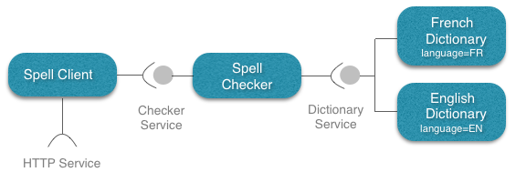
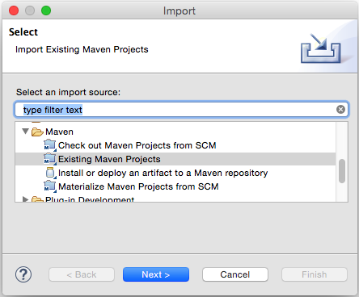
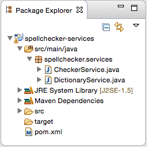

[Home](../../../../) > [Documentation](../../) > [Tutorials](../) > [Spellchecker](./)

## COHORTE for Java

Welcome to COHORTE for Java! With COHORTE, you can build modular and resilient applications using the Java programming language, and take advantage of the many benefits of the COHORTE approach (see [what is COHORTE?]({{ site.baseurl}}/docs/1.x/what-is-cohorte)).

Note

    If you are already familiar with <a href="http://www.osgi.org">OSGi</a>, COHORTE components are a simple <a href="http://felix.apache.org/documentation/subprojects/apache-felix-ipojo.html">Apache Felix iPOJO</a> components. The only thing you should do to be able to run your components in COHORTE is to not instantiate your them manually (using <code>@Instantiate</code> annotation for instance. COHORTE will do it for you and add <a href="{{ site.baseurl }}/docs/1.x/what-is-cohorte">many features</a> to your final application.

### Spellchecker application

The application to develop in this tutorial provides a web interface in which users can check the spell of their sentences in one or another language. It concists of three main type of components as shown in the following picture:

 

1. **Dictionary components**: implementing and providing the *Dictionary Service*. Each implementation indicates the language of the dictionary as a service property.
2. **Spell Checker**: implements the *Checker Service* which take as input a sentence of words, and by using the *Dictionary Service* it verifies the existance of misspelled words. It uses the adequate provided *Dictionary Service*s depending on user language choice. A list of missplened words are returned by this service.
3. **Spell Client**: is a simple web interface that shows a form to the final user to test the application. This component uses the *Checker Service* for the application's logic part, and it also requires an *HTTP Service* to publish the web interface and response to the form requests initiated by the user.

The required *HTTP Service* for the last component **Spell Client** is provided natively by the COHORTE runtime. No need to implement it! In the following, we show you how the different components are implemented in Python or Java programming languages.

### Setup

The first thing we need to do is to set up the development environment. We will be using [Apache Maven](http://maven.apache.org), although you can use whatever build tool you feel confortable using. If you wish to use something else to build this tutorial (such as Ant), you will need to manually account for all the needed dependencies.

### Spellchecker Java projects

In order to implement the spellchecker demo application, we decided to decouple it in different bundles (jars) for more modularity and to be able to dynamically update or replace some parts of the application without stopping the system. These bundles are:

 * `spellchecker-services`
 * `spellchecker-en-dictionary`
 * `spellchecker-fr-dictionary`
 * `spellchecker-checker`
 * `spellchecker-client`

 In the first bundle `spellchecker-services` we will put only the Java Interfaces for the **Dictionary Service** and **Checker Service** as explained in the picture above. The Services are supposed to not change over time. The other bundles uses or implements this services to ensure the application's functionality. 

 In the following, we will show you how to implement each of this bundles.

 

#### spellchecker-services

To create a Maven project, simply type the following command (ensure to have Apache Maven installed). 

<pre>
$ <b>cohorte-create-java-project</b> spellchecker spellchecker-services 1.0.0
</pre>

The first argument for the `cohorte-create-java-project` command is the **groupId** of your Maven project, the second one is the **artifactId**, and the last one is its **version**.

This command will generate an empty Maven project template for a COHORTE project **spellchecker-services** which has the following structure:

 * `pom.xml`: an XML file that contains information about the project and configuration details used by Maven to build the project. 
 * `src/main/java/mypackage/`: this folder will contain Java source code of the bundle.
    

Note

Any maven project is identified by it groupId, artifactId, and version number. You find this information in the <code>pom.xml</code> file. Any dependencies to other libraries should be declared also in the <code>pom.xml</code> file. Maven retrieves them automatically when compiling the project.

Open eclipse and import this Maven project (ensure that **m2e plugin** is installed on your Eclipse IDE - see [this page for more information]( {{ site.baseurl }}/docs/1.X/ide))

Rename the default package `mypackage` to `spellchecker.services` and add two interfaces `DictionaryService` and `CheckerService`.

 

Update `pom.xml` file to reflect this new structure. The `spellchecker.services` package will be exported, so that other bundles can use the interfaces and classes within this package at runtime. 


...
<Export-Package>
   spellchecker.services
</Export-Package>
...


Remove the dependency to `org.apache.felix.ipojo.annotations` as we have no component to be implemented in this bundle. 

The two newly created Java interfaces represent service contracts and they have the following methods:


package spellchecker.services;

public interface DictionaryService {
    boolean check_word(String word);
    String getLanguage();
}


The **Dictionary Service** takes a word as a string and returns true if it is found in the dictionary. 


package spellchecker.services;

import java.util.List;

public interface CheckerService {
    List<String> check(String paragraph, String language);
}


The **Checker Service** takes a paragraph as a string and the language on which we want to check the paragraph and returns the list of missplened words according to the selected language.

Compile this bundle by right-clicking on the `pom.xml` file, then choose *Run As* and then *Maven install*. Or just type the following command at the top level directory of this bundle:


$ mvn clean install


 

#### spellchecker-en-dictionary

To implement the english dictionary provider, you have to follow the same steps as before. You first create a new project template as follow:

<pre>
$ <b>cohorte-create-java-project</b> spellchecker spellchecker-en-dictionary 1.0.0
</pre>

Start by modifying the `pom.xml` file to include a dependency to `spellchecker-services` bundle.


  <dependencies>
    <dependency>
      <groupId>org.apache.felix</groupId>
      <artifactId>org.apache.felix.ipojo.annotations</artifactId>
      <version>1.12.0</version>
      <scope>provided</scope>
    </dependency>
    <dependency>
      <groupId>spellchecker</groupId>
      <artifactId>spellchecker-services</artifactId>
      <version>1.0.0</version>
    </dependency>
  </dependencies>


Rename the default package to `spellchecker.dictionaries` and add `<Private-Package>` configuration to your `pom.xml` file to mention that this package is not exported (and hence not visible for other bundles).


<Private-Package>
  spellchecker.dictionaries
</Private-Package>
<Import-Package>
  spellchecker.services
</Import-Package>


Ensure to remove the `<Export-Package>` configuration as no package is exported by this bundle, and to add `<Import-Package>` configuration to import the **SpellChekcer Services** already bundled.

Finally, creates a new Java class named `EnglishDictionary.java` in `spellchecker.dictionaries`package and implements it as follow:


package spellchecker.dictionaries;

import java.util.*;
import org.apache.felix.ipojo.annotations.*;
import spellchecker.services.DictionaryService;

@Component
@Provides
public class EnglishDictionary implements DictionaryService {
    List<String> dictionary = 
            Arrays.asList("hello" , "world", "welcome", "to", "cohorte");
    public boolean check_word(String word) {        
        word = word.toLowerCase().trim();
        return this.dictionary.contains(word);
    }
    public String getlanguage() {       
        return "EN";
    }
}


This class is an iPOJO component that provides (implements) the **Dictionary Service** and publish it on the service registry with the service property *language* set to *EN*. This allow consumer filtering/selecting service providers depending on this published service properties.

Note

Have a look at <a href="http://goo.gl/DJ2XiY" target="_blanc">this page</a> for more information about providing services in iPOJO.

Compile this second bundle as you have done for the first one.

Create another bundle project for the **French Dictionary** and change the default implementation to have french words list. Ensure to modify the *language* service property to be *FR*. 

 

#### spellchecker-checker

This component uses the available **Dictionary Service**s and allows clients to check their paragraphs if they have misspelled words.

 * Generate a project template for this bundle using the `cohorte-create-java-project` command:

<pre>
$ <b>cohorte-create-java-project</b> spellchecker spellchecker-checker 1.0.0
</pre>

 * Modify the `pom.xml` file to include a dependency to `spellchecker-services` as you have for the previous bundle.
 * Rename the default package to `spellchecker.checker` and add `<Private-Package>` configuration to your `pom.xml` file to mention that this package is not exported.
 * Remove the `<Export-Package>` configuration, and add `<Import-Package>` configuration to import the package containing the **SpellChekcer Services** (interfaces) already bundled (see previous steps).
 * Create the `Checker.java` class and implement it as follow:

 
package spellchecker.checker;

import java.util.*;
import org.apache.felix.ipojo.annotations.*;
import spellchecker.services.*;

@Component
@Provides
public class Checker implements CheckerService {
    Map<String, DictionaryService> dictionaries = 
            new HashMap<String, DictionaryService>();
    
    @Bind(aggregate=true)
    public void bind_dict(DictionaryService dict) {
        this.dictionaries.put(dict.getLanguage(), dict);
    }
    
    @Unbind
    public void unbind_dict(DictionaryService dict) {
        this.dictionaries.remove(dict.getLanguage());
    }
    
    public synchronized List<String> check(String paragraph, String language) {         
        String[] checked_words = paragraph.split(" ");
        DictionaryService dict = this.dictionaries.get(language);
        if (dict != null) {
            List<String> result = new ArrayList<String>();
            for (int i=0; i<checked_words.length; i++) {
                if (dict.check_word(checked_words[i]) == false) {
                    result.add(checked_words[i]);
                }
            }
            return result;
        }
        return null;
    }
}


Each time a **Dictionary Service** is deployed at runtime, this component is notified via the `@Bind` annotation. In our case, we save all the dictionaries in an internal map for use in the `check` method.

 

#### spellchecker-client

Now its time to implement the last component providing the web interface: `spellchecker-client`.

 * Generate a project template for this bundle using the `cohorte-create-java-project` command:

<pre>
$ <b>cohorte-create-java-project</b> spellchecker spellchecker-client 1.0.0
</pre>

 * Modify the `pom.xml` file to include a dependency to `spellchecker-services` as you have done for the previous bundles.
 * Rename the default package to `spellchecker.client` and add `<Private-Package>` configuration to your `pom.xml` file to mention that this package is not exported.
 * Remove the `<Export-Package>` configuration, and add `<Import-Package>` configuration to import the package containing the **SpellChekcer Services** (interfaces) already bundled (see previous steps).
 * Create the `SpellChecker.java` class and implement it as follow:


package spellchecker.client;

import java.io.IOException;
import java.util.List;
import javax.servlet.http.*;
import javax.servlet.ServletException;
import org.apache.felix.ipojo.annotations.*;
import org.osgi.service.http.HttpService;
import spellchecker.services.CheckerService;

@Component
public class SpellChecker extends HttpServlet {

    @Requires
    CheckerService checker;
    
    @Requires
    HttpService httpService;
    
    @Bind
    public void bind_http(HttpService http) {
        try {
            httpService.registerServlet("/spellchecker", this, null, null);
        } catch (Exception e) {
            e.printStackTrace();
        }
    }
    
    @Unbind
    public void unbind_http(HttpService http) {
        httpService.unregister("/spellchecker");
    }
    
    @Override
    protected void doGet(HttpServletRequest req, HttpServletResponse resp)
            throws ServletException, IOException {
        String result = "";
        String paragraph = req.getParameter("paragraph");
        String language = req.getParameter("language");
        if (paragraph == null || language == null) {
            result = "Fill the language and paragraph inputs!";
        } else {
            List<String> misspelled_words = this.checker.check(paragraph, language.toUpperCase());
            if (misspelled_words == null) {
                result = "Dictionary provider for this language is not installed!";
            } else {
                result += "<b>The misspelled words are:</b> ";
                result += "";
                for (String word : misspelled_words) {
                    result += " " + word;
                }
                result += "";
            }
        }
        String html = "";
        html += "<html><head><title>SpellChecker</title></head><body>";
        html += "<h2>Spellchecker Demo</h2>";
        html += "
";
        html += "<form action=\"/spellchecker\" method=\"get\" >";
        html += "Language: <input type=\"radio\" name=\"language\" value=\"EN\">EN";
        html += "<input type=\"radio\" name=\"language\" value=\"FR\">FR";
        html += "<input type=\"radio\" name=\"language\" value=\"CN\">CN ";
        html += "Paragraph: <input type=\"text\" name=\"paragraph\" size=\"50\"/> ";
        html += "<input type=\"submit\" value=\"Check\"/>";
        html += "</form>";
        html += "
";
        html += result;
        html += "
";
        html += "</body></html>";
        
        resp.getWriter().write("Hello World");
    }
    
}


### Running your application

To start running your awesome first COHORTE application, you need to [download](../../downloads) and install the COHORTE runtime platform in your local machine (see the [setup section of the reference guide]({{ site.baseurl }}/documentation/reference-guide/setup.html) for more information). 

In the following, we suppose that you have a Max OS X platform. Download the archive file of the COHORTE runtime from the [downloads page]({{ site.baseurl}}/downloads) (e.g., cohorte-1.0.0-macosx.tar.gz).

Extract the dowloaded file anywhere in your file system and create the *environment Variable* **$COHORTE_HOME** which has as value the fullpath to `home` sub-folder of the extracted archive file (note that you can just double click on `home/setup.command` file to setup this environment variable).

The `home` sub-folder contains the main COHORTE runtime libraries and configuration files. Whereas the `base` folder contains user-specific bundles and configurations. To run your spellchecker application you need to:

 * move your spellchecker package folder to `base/repo` folder.
 * fill the `base/conf/autorun_conf.js` file with the description of application's components to be instantiated (see more information about [the formalism in the reference guide]({{ site.baseurl }}/documentation/reference-guide/applications.html)).


{
    "name" : "spellchecker-demo-app",
    "root" : {
        "name" : "spellchecker-java-demo",
        "components" : [ {
            /**
             * EN Dictionary
             */
            "name" : "dictionary_en_java",
            "factory" : "spell_dictionary_en_factory",
            "language" : "java"
        }, {
            /**
             * FR Dictionary
             */
            "name" : "dictionary_fr_java",
            "factory" : "spell_dictionary_fr_factory",
            "language" : "java"
        }, {
            /**
             * Spell Checker
             */
            "name" : "spell_checker_java",
            "factory" : "spell_checker_factory",
            "language" : "java"
        }, {
            /**
             * Spell Client
             */
            "name" : "spell_client_java",
            "factory" : "spell_client_factory",
            "language" : "java"
        } ]
    }
}


This description defines a new application named `spellchecker-demo-app`on which four components will be instantiated. The wiring between the different components is done automatically following the service-oriented architecture (service providers and service consumers) even if one component is placed in remote nodes (see [COHORTE applications reference guide]({{ site.baseurl }}/documentation/reference-guide/applications.html) for more information on how to personalise your application's architecture). 

By default, with this minimal description, all the components will be instantiated in one Python isolate (as all the components are implemented in Python). Recall that a COHORTE Isolate is a seperate process (or a gateway) executing a set of components. The Python Isolate consists in Pelix platform hosting your different bundles as well as the needed system bundles (including the HTTP service provider). 

COHORTE runtime components managing your application's isolates and the distribution of components among them are located on a special purpose (static) isolate (called `cohorte-isolate`). There is one `cohorte-isolate`per node, but only one is started as a **Top Isolate** which manage all other isolates.  

Next, you need to launch your application... 


./run.sh -t -c


NOTE

For more setup and startup configurations, please check <a href="{{ site.baseurl }}/docs/1.x/startup">this page</a>.

### Test your application

The resulting Spell Client looks like this:

The important quality of this architecture is the capability to update any component without restarting the global application. This is important to allow adding new *Dictionary Service*s or updating a new efficient version of the **Spell Checker** component, without stopping the system and hence guaranting the continuity of business services.

The different application components can be deployed on different Isolates. This is important to ensure that a failure of one or more components does not affect the other ones. The isolation is managed automatically by COHORTE, this feature is explored with more details in [this tutorial](../temper/).

### Monitoring

[Home](../../../../) > [Documentation](../../) > [Tutorials](../) > [Spellchecker](./)
