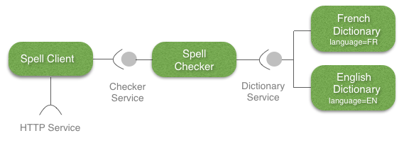
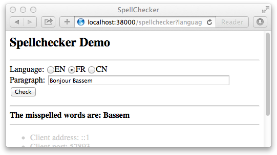

[Home](../../../../) > [Documentation](../../) > [Tutorials](../) > [Spellchecker](./)

## COHORET for Python

Welcome to COHORTE for Python! With COHORTE, you can build modular and resilient applications using the [Python programming language](https://www.python.org), and take advantage of the many benefits of the COHORTE approach (see [what is COHORTE?]({{ site.baseurl }}/docs/1.x/what-is-cohorte)).  

### Spellchecker application

The application to develop in this tutorial provides a web interface in which users can check the spell of their sentences in one or another language. It concists of three main type of components as shown in the following picture:

 

1. **Dictionary components**: implementing and providing the *Dictionary Service*. Each implementation indicates the language of the dictionary as a service property.
2. **Spell Checker**: implements the *Checker Service* which take as input a sentence of words, and by using the *Dictionary Service* it verifies the existance of misspelled words. It uses the adequate provided *Dictionary Service*s depending on user language choice. A list of missplened words are returned by this service.
3. **Spell Client**: is a simple web interface that shows a form to the final user to test the application. This component uses the *Checker Service* for the application's logic part, and it also requires an *HTTP Service* to publish the web interface and response to the form requests initiated by the user.

The required *HTTP Service* for the last component **Spell Client** is provided natively by the COHORTE runtime. No need to implement it! In the following, we show you how the different components are implemented in Python or Java programming languages.

### Implementation

In this section, we will detail how the different components are implemented. For simplicity, we will not use a modern Integrated Developement Environment like eclipse, we rather create simple text files for the different Python code implementing our application components.

NOTE

Check <a href="{{ site.baseurl}}/docs/1.X/ide">this page</a> for instructions on how to use your prefered IDE like Eclipse (PyDev) or IDEA (PyCharm).

First, create a directory called `spellchecker`on which you will put the different components.

Create a file called `__init__.py` within the `spellchecker` package folder. This file contains the name of the different services of our application as follow:


#!/usr/bin/python
SERVICE_DICTIONARY = 'demos.spellchecker.dictionaryService'
SERVICE_CHECKER = 'demos.spellchecker.checkerService'


A COHORTE Component is implemented in python as a simple module with some specific class and method decorators. The following python code `spell_dictionary_EN.py` shows the implementation of the **English Dictionary** component. 

#### English Dictionary
[spell_dictionary_EN.py](https://github.com/isandlaTech/cohorte-demos/blob/master/spellchecker/bundles/spellchecker-python/src/main/python/spellchecker/spell_dictionary_EN.py)

#!/usr/bin/python
from pelix.ipopo.decorators import ComponentFactory, Property, Provides, \
    Validate, Invalidate

@ComponentFactory("dictionary_en_factory")
@Provides(spellchecker.SERVICE_DICTIONARY)
@Property("_language","language","EN")
class SpellDictionary(object):
    def __init__(self):
        self._dictionary = None
        self._language = None

    @Validate
    def validate(self, context):
        self._dictionary = {"hello" , "world", "welcome", "to", "cohorte"}

    @Invalidate
    def invalidate(self, context):
        self._dictionary = None

    def check_word(self, word):
        word = word.lower().strip()
        return not word or word in self._dictionary



We have a simple Python module containing a class called `SpellDictionary`. In this module we have used several decorators defined and imported from  `pelix.ipopo` package. This package (Pelix/iPOPO project) is our python supported component-based framework in COHORTE (For more information about the supported component-based models, check [this page]({{site.baseurl}}/documentation/reference-guide/components.html) of the reference guide). 

Here are some explanations of the meanning and effects of each decorator:

 * `@ComponentFactory` allows COHORTE to consider this class as a *component factory* which is an object used to instantiate $Component*s of the class `SpellDictionary` at runtime. The name given between parenthesis is the factory name. 

 * `@Provides` makes this component as a service provider for the service given between parenthesis (*SERVICE_DICTIONARY*). This service has one method (*check_word*) that any provider should implement. 

 * `@Property` add some contextual properties to the provider implementation of the service. Here in this example, we add the property *language* and set its value to `EN`. When another component requires the *dictionary_service*, it can filter the providers depending on this properties (for instance take only dictionary providers for english language - having language property set to `EN`).

In addition to this class decorators, we have also two method decorators:

 * `@Validate` lets the COHORTE runtime calls the decorated method when the component instance is lanched and is in a valid state.

 * `@Invalidate` lets the COHORTE runtime calls the decorated method when the component is not valid (dependencies of this component are not resolved for instance).

The french dictionary implementation (not showed here) is mainly the same as the english implementation of the **Dictionary Service**. The only differences are the *language* property set to `EN` and the *self._dictionary_* variable containing instead a set of french words.

We will now implement the **Spell Checker** service provider as shown on the following code :

#### Spell Checker

[spell_checker.py](https://github.com/isandlaTech/cohorte-demos/blob/master/spellchecker/bundles/spellchecker-python/src/main/python/spellchecker/spell_checker.py)


#!/usr/bin/python
from pelix.ipopo.decorators import ComponentFactory, Provides, \
    Validate, Invalidate, Requires, BindField, UnbindField
import re

@ComponentFactory("checker_factory")
@Provides(spellchecker.SERVICE_CHECKER)
@Requires("_dictionaries", spellchecker.SERVICE_DICTIONARY, aggregate=True)
class SpellChecker(object):
    def __init__(self):
        self._dictionaries = []
        self.languages = {}

    @BindField('_dictionaries')
    def bind_dict(self, field, service, svc_ref):
        language = svc_ref.get_property('language')
        self.languages[language] = service

    @UnbindField('_dictionaries')
    def unbind_dict(self, field, service, svc_ref):
        language = svc_ref.get_property('language')
        del self.languages[language]

    def check(self, paragraph, language="EN"):
        checked_list = re.split(" ", paragraph)
        try:
            dictionary = self.languages[language]
        except KeyError:
            return None
        return [word for word in checked_list
                if not dictionary.check_word(word)]


This second component provides **Checker Service** and it requires **Dictionary Service** to operate on the input data. Notice that we have set the *aggregate* option of the `@Requires`decorator to *true* so that all the possible providers of the **Dictionary Service** are injected in the specified class attribute *_dictionaries*. 

In addition to already explained decorators used in the first component, in this module we have used this two new decorators:

 * `@BindField`: calls the decorated method when a new provider of the **Dictionary Service** is detected at runtime. In this case, we want to get the service property *language* to construct a map of <language/provider> peers. This property is retrieved from the service reference *svc_ref* to the actual **Dictionary Service** provider.
 * `@UnbindField`: calls the decorated method when one provider of the *dictionary_service* in no longer available. We update our internal map in response to this change. 

The *checker_service* implemented by this component has one methdd *check*. It takes a paragraph and a language parameters and uses the available **Dictionary Service$* providers to check the spell of paragraph's words. This service is used by the next component *Spell Client*.

#### Spell Client 

[spell_client.py](https://github.com/isandlaTech/cohorte-demos/blob/master/spellchecker/bundles/spellchecker-python/src/main/python/spellchecker/spell_client.py)


#!/usr/bin/python

from pelix.ipopo.decorators import ComponentFactory, Provides, Property, \
    Validate, Invalidate, Requires
from pelix.utilities import to_str

import pelix.remote
try:
    import urllib.parse as urlparse
except ImportError:
    import urlparse

@ComponentFactory("spell_client_factory")
@Provides(specifications='pelix.http.servlet')
@Property('_path', 'pelix.http.path', "/spellchecker")
@Requires("_checker", "checker_service")
@Property('_reject', pelix.remote.PROP_EXPORT_REJECT, ['pelix.http.servlet'])
class SpellClient(object):
    def __init__(self):
        self._path = None
        self._checker = None

        def do_GET(self, request, response):
            """
            Handle a GET
            """
            query = request.get_path()
            query = query[query.rfind('?')+1:]
            data = urlparse.parse_qs(query)
            paragraph = ""
            language = ""
            result = ""
            try:
                paragraph = data['paragraph'][0]
                language = data['language'][0]
                language = language.upper()
                misspelled_words = self._checker.check(paragraph, language)
                if misspelled_words is None:
                    result = 'Dictionary provider for this language is not installed!'
                else:
                    if not misspelled_words:
                        result = 'All words are well spelled !'
                    else:
                        result = "<b>The misspelled words are: </b>"
                        result += ""
                        result += " ".join(misspelled_words) + ""
            except (KeyError, IndexError):
                result = "Fill the language and paragraph inputs!"
            content = """
            <html><head><title>SpellChecker</title></head><body>
                <h2>Spellchecker Demo</h2>
                

                <form action="/spellchecker" method="get" >
                    Language: <input type="radio" name="language" value="EN">EN
                    <input type="radio" name="language" value="FR">FR
                    <input type="radio" name="language" value="CN">CN 
                    Paragraph: <input type="text" name="paragraph" size="50"/> 
                    <input type="submit" value="Check"/>
                </form>
                

                {result}
                

            </body></html>
            """.format(result=result)
            response.send_content(200, content)


This last component implements and provides the *pelix.http.servlet* so that it will be called by the web server when a request arrives. The *HTTP Service* provider (included in COHORTE) call the *do_GET* method of this component. In our example, we return via the response object a valid html page with a form asking the user to choose a language and put his sentence to check.

### Running your application

To start running your awesome first COHORTE application, you need to [download](../../downloads) and install the COHORTE runtime platform in your local machine (see the [setup section of the reference guide]({{ site.baseurl }}/documentation/reference-guide/setup.html) for more information). 

In the following, we suppose that you have a Max OS X platform. Download the archive file of the COHORTE runtime from the [downloads page]({{ site.baseurl}}/downloads) (e.g., cohorte-1.0.0-macosx.tar.gz).

Extract the dowloaded file anywhere in your file system and create the *environment Variable* **$COHORTE_HOME** which has as value the fullpath to `home` sub-folder of the extracted archive file (note that you can just double click on `home/setup.command` file to setup this environment variable).

The `home` sub-folder contains the main COHORTE runtime libraries and configuration files. Whereas the `base` folder contains user-specific bundles and configurations. To run your spellchecker application you need to:

 * move your spellchecker package folder to `base/repo` folder.
 * fill the `base/conf/autorun_conf.js` file with the description of application's components to be instantiated (see more information about [the formalism in the reference guide]({{ site.baseurl }}/documentation/reference-guide/applications.html)).


{
    "name" : "spellchecker-demo-app",
    "root" : {
        "name" : "spellchecker-demo",
        "components" : [ {
            "name" : "dictionary_en",
            "factory" : "dictionary_en_factory",
            "language" : "python"
        }, {
            "name" : "dictionary_fr",
            "factory" : "dictionary_fr_factory",
            "language" : "python"
        }, {
            "name" : "checker",
            "factory" : "checker_factory",
            "language" : "python"
        }, {
            "name" : "spell_client",
            "factory" : "client_factory",
            "language" : "python"
        } ]
    }
}


This description defines a new application named `spellchecker-demo-app`on which four components will be instantiated. The wiring between the different components is done automatically following the service-oriented architecture (service providers and service consumers) even if one component is placed in remote nodes (see [COHORTE applications reference guide]({{ site.baseurl }}/documentation/reference-guide/applications.html) for more information on how to personalise your application's architecture). 

By default, with this minimal description, all the components will be instantiated in one Python isolate (as all the components are implemented in Python). Recall that a COHORTE Isolate is a seperate process (or a gateway) executing a set of components. The Python Isolate consists in Pelix platform hosting your different bundles as well as the needed system bundles (including the HTTP service provider). 

COHORTE runtime components managing your application's isolates and the distribution of components among them are located on a special purpose (static) isolate (called `cohorte-isolate`). There is one `cohorte-isolate`per node, but only one is started as a **Top Isolate** which manage all other isolates.  

Next, you need to launch your application... 


./run.sh -t -c


NOTE

For more setup and startup configurations, please check <a href="{{ site.baseurl }}/docs/1.x/startup">this page</a>.

### Test your application

The resulting Spell Client looks like this:

The important quality of this architecture is the capability to update any component without restarting the global application. This is important to allow adding new *Dictionary Service*s or updating a new efficient version of the **Spell Checker** component, without stopping the system and hence guaranting the continuity of business services.

The different application components can be deployed on different Isolates. This is important to ensure that a failure of one or more components does not affect the other ones. The isolation is managed automatically by COHORTE, this feature is explored with more details in [this tutorial](../temper/).

### Monitoring

[Home](../../../../) > [Documentation](../../) > [Tutorials](../) > [Spellchecker](./)