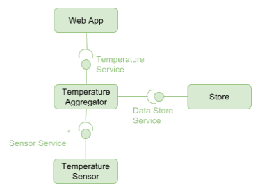
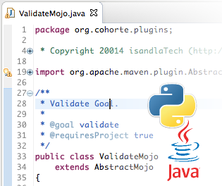
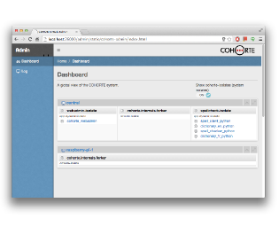

[Home](../../../) > [Documentation](../)

## Solution Overview

COHORTE is a platform for developing and rolling out robust and reliable software.
Software produced with COHORTE has a high level of robustness and reliability since its is made up of a range of components and services protected from one another by isolation containers. This modular architecture guarantees that software cannot be paralyzed in the event of failure of one of its components and that, for example, 100% of the data communicated is processed.

This modular architecture ensures automatic service recovery after errors and to supply degraded responses in the event of unavailability of a component.
The platform incorporates a range of tried and tested basic components dramatically reducing specific developments, thereby reducing the cost of projects using them.
The level of reliability of software produced with COHORTE SDK also reduces operating and maintenance costs for the companies software packages.

## Goals and Benefits

There are a number of benefits to using COHORTE to build your software applications. The most evident ones are:

  

	

		<h3>Service-oriented Component-based Applications</h3>
		
COHORTE provides a framework to construct modularised applications consisting of software components that uses software services provided by other components. This approach allows to construct IT applications as mean of a set of components providing and requiring services. 

	

	

		
	

  

	

		
	

	

		<h3>Multi-language programming</h3>
		
Components in a COHORTE system can be implemented using your Java or Python programming languages (other languages are under study). You can also wrap C modules within Python components to use legacy C code. In addition, you can dynamically update the C code without any complications.COHORTE uses two similar Service-Oriented Component-based frameworks for Java and Python environments. Service provider can be implemented using Python and used by another component implemented in Java.

	

  

	

		<h3>Components Distribution</h3>
		
COHORTE developers provides only implementations for the different components providing or requiring services. At runtime, the concret placement of components in execution nodes is managed by the COHORTE runtime. Two component can work together transparantly even they are located on two seperate machines.

	

	

		
	

  

	

		
	

	

		<h3>Heterogeneous Environments</h3>
		
COHORTE components can be executed on different kind of devices, from small devices like Raspberry-Pi to big servers whereas having windows, linux, or Max os operating systems.

	

  

	

		<h3>Dynamic Isolation and Resilience</h3>
		
COHORTE automatically prevent and correct component failures by isolating them and relanching them seperatly from others. Users can also define static isolates in which they put components that are guaranteede to be safe.

	

	

		
	

  

	

		
	

	

		<h3>Development and Monitoring Tools</h3>
		
COHORTE Platform includes a centralized monitoring web interface for all the running nodes. This interface allows to dynamically watch what is happening in the COHORTE system (Nodes, Isolates, and Components updates)

	

## Convinced?

If COHORTE is what you want for your IT applications, try it out! [Here are some resources to get
started]({{ site.baseurl }}/docs/1.x/tutorials). 

## About

 Project is an open source framework hosted on GitHub and sponsored by [isandlaTech](http://isandlatech.com). To help you developping your business applications using COHORTE, feel free to contact isandlaTech's support team at [contact@isandlatech.com](mailto:contact@isandlatech.com).

